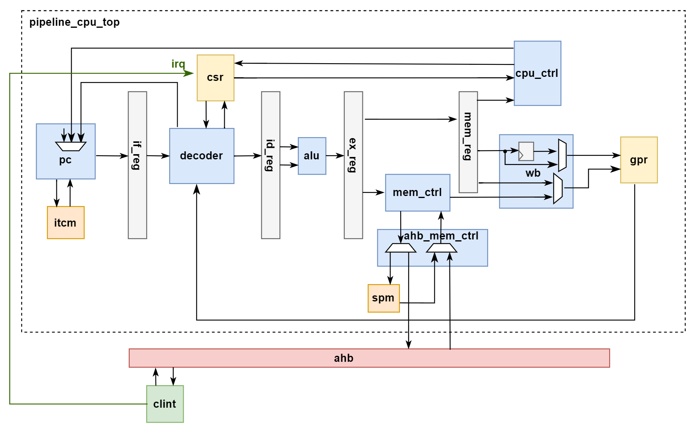
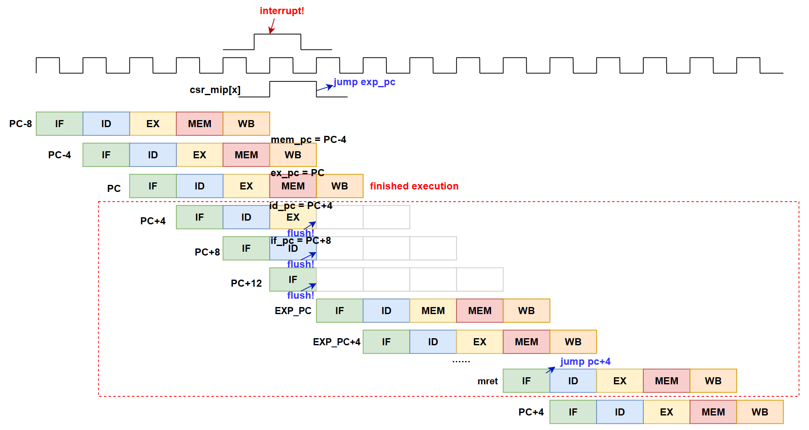
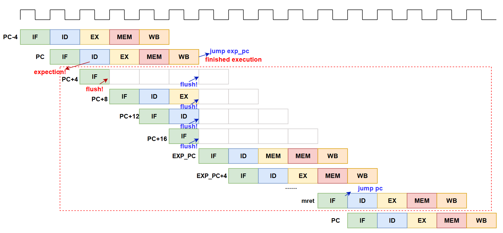
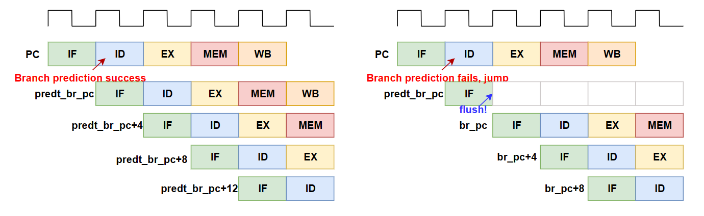
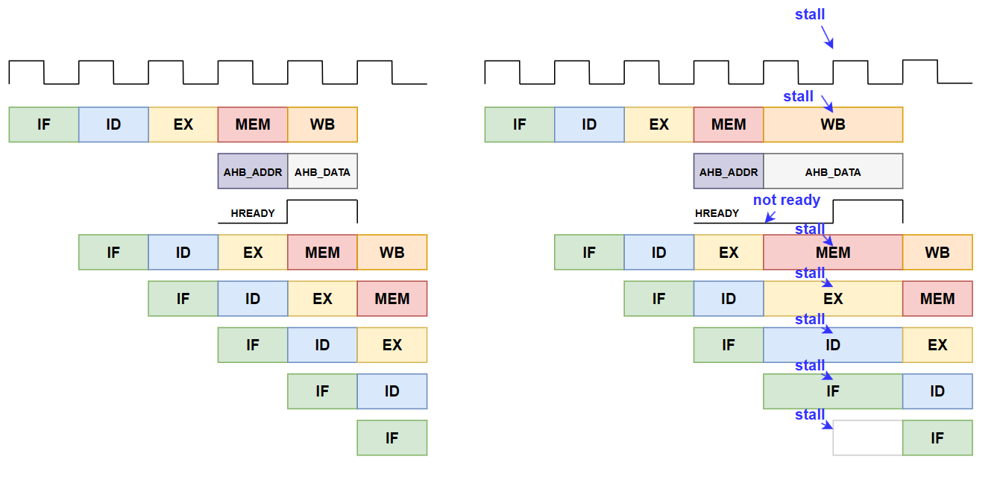

# siiCpu

## 1. Design Specifications


Here is an introduction to siiCpu

- The CPU supports the complete rv32i instruction set, which can execute basic arithmetic, logic, shift, branch, jump, and other instructions.

- The CPU supports privileged instructions, which can implement system calls and exception handling, and only supports machine mode here.

- The CPU supports the processing of interrupts and exceptions, can respond to external interrupts and internal exceptions, and when an interrupt exception occurs, the hardware is responsible for recording the cause of the exception, the `pc` at the time of the exception, etc, and automatically jumps to the TRAP entry program pointed to by `mtvec`. Software is responsible for context protection, and hardware returns to continue executing the original program after receiving the mret instruction.

- The CPU includes 32 general-purpose registers for storing operands and results, with the x0 register fixed at 0.

- The CPU includes basic CSR registers for storing control and status information, such as interrupt enable (`mie`), interrupt suspend (`mip`), exception code (`mcause`), etc.

- The CPU is designed with a five-stage pipeline, including fetch, decode, execute, memory access, and write back, connected by pipeline registers.

- The CPU uses simple static branch prediction. For conditional branch instructions, the immediate number in the instruction is used to determine whether to jump. If the jump address is after the instruction, the jump occurs. For unconditional jump instructions, it is predicted that they always jump. Since the `jr ra` instruction is a function return instruction and occurs frequently, an interface is directly designed to read the `ra` register in the general-purpose register.

- The CPU adopts the Harvard architecture, and the instruction and data storage are separated and accessed by itcm and spm, respectively. Single-cycle reading improves memory access efficiency.

- The data width of itcm and spm is 32 bits, and one word of data can be read or written at a time. The capacity of itcm and spm can be configured as needed.

- At the memory access module can access the bus and decide whether to access the spm or the bus by address decoding, where the bus satisfies the AHB-lite protocol.

- CLINT is used to generate software interrupts and timer interrupts. There is an `msip` register, which is triggered by software, and there is a 64-bit `mtime` timer, which is counted by a low-frequency clock and triggers the timer interrupt when its value is equal to the value in the `mtimecmp` register. All three registers can be read and written by the bus.



### 1.1 General Purpose Registers

|reg|ABI name| description |Saver|
|---|---|---|---|
| x0 |	zero |	The 0-value register, is ignored for writes and always set to 0 for reads|	-
| x1 |	ra	|Function return address|Caller
| x2 |	sp	|Stack pointer	|Callee
| x3 |	gp	|Global pointer|-
| x4 |	tp	|Thread pointer|-
| x5 |	t0	|Temporary register or alternate link register|Caller
| x6-x7 | t1-t2 | Temporary register|Caller
| x8 |	s0/fp | The register to save or the frame pointer register|Callee
| x9 |	s1 | Registers that need to be saved to hold critical data in the original process and avoid being destroyed during function calls|Callee
|x10-x11 | a0-a1 | Function arguments/return values|Caller
|x12-x17 | a2-a7 | Function arguments|Caller
|x18-x27 | s2-s11 | Registers to save|Callee
|x28-x31 | t3-t6 | Temporary registers|Caller

### 1.2 Contral and State Registers

|reg|address| read and write |
|---|---|---|
| mstatus| 0x300 |RW |
| mie| 0x304 |RW |
| mtvec| 0x305 |RW |
| mscratch| 0x340 |RW |
| mepc |0x341 |RW |
| mcause |0x342 |RW	|
| mtval |0x343  |RW	|
| mip |0x344| RW |

### 1.3 Bus Address Space
|element|address|description|
|---|---|---|
|spm|0x9000_0000 ~ 0x9000_3fff|Data memory|
|itcm|0x8000_0000 ~ 0x8000_3fff|Insn memory|
|plic|0x0c00_0000 ~ 0x0cff_ffff|Platform level interrupt controller|
|clint|0x0200_0000 ~ 0x0200_ffff|Core local interrupt controller|
|uart0|0x1001_3000 ~ 0x1001_3fff|uart|

#### 1.3.1 clint memory mapped address
|element|address|description|
|---|---|---|
|clint_mtime_high|0x0200_bfff|The high 32 bits of the timer|
|clint_mtime_low|0x0200_bff8|The low 32 bits of the timer|
|clint_mtimecmp_high|0x0200_4004|Config register comparison values|
|clint_mtimecmp_low|0x0200_4000|Config register comparison values|
|clint_msip|0x0200_0000|software interrupt|

### 1.4 Instructions

1. Integer arithmetic instruction
``` arm
addi    rd, rs1, imm[11；0]
slti    rd, rs1, imm[11；0]     
sltiu   rd, rs1, imm[11；0]     
andi    rd, rs1, imm[11；0]     
ori     rd, rs1, imm[11；0]
xori    rd, rs1, imm[11；0]     
slli    rd, rs1, shamt[4:0]     
srli    rd, rs1, shamt[4:0]     
srai    rd, rs1, shamt[4:0]
lui     rd, imm
auipc   rd, imm
add     rd, rs1 , rs2
sub     rd, rs1 , rs2
slt     rd, rs1 , rs2
sltu    rd, rs1 , rs2
and     rd, rs1 , rs2
or      rd, rs1 , rs2
xor     rd, rs1 , rs2
sll     rd, rs1 , rs2
srl     rd, rs1 , rs2
sra     rd, rs1 , rs2
```
2. Branch and jump instruction
``` arm
jal     rd, label
jalr    rd, rs1, imm
beq     rs1, rs2, label
bne     rs1, rs2, label
blt     rs1, rs2, label
bltu    rs1, rs2, label
bge     rs1, rs2, label
bgeu    rs1, rs2, label
```
3. Integer Load/Store instruction
``` arm
lw      rd, offset[11:0](rs1)
lh      rd, offset[11:0](rs1)
lhu     rd, offset[11:0](rs1)
lb      rd, offset[11:0](rs1)
lbu     rd, offset[11:0](rs1)
sw      rs2, offset[11:0](rs1)
sh      rs2, offset[11:0](rs1)
sb      rs2, offset[11:0](rs1)
```
4. CSR insterction
``` arm
csrrw   rd, csr, rs1
csrrs   rd, csr, rs1
csrrc   rd, csr, rs1
csrrwi  rd, csr, imm[4:0]
csrrsi  rd, csr, imm[4:0]
csrrci  rd, csr, imm[4:0]
```
5. special instruction
``` arm
ecall
ebreak
mret
```

## 2. Pipeline Processing

Because of the existence of the pipeline, the internal general purpose register is accessed in the decoding stage, and the write back is performed in the fifth stage, which will inevitably lead to data hazard. 

At the same time, the jump instruction can only be determined in the decoding stage. In the instruction fetch, the static branch prediction is used. If the prediction error is found in the decoding stage, there will be a control hazard, that is, an instruction that should not be executed after the jump instruction needs to be flushed. 

Also, when accessing the bus, the slave device will ask to wait, the memory data cannot be read out, and the pipeline needs to be paused.

### 2.1 Interrupt Exception

- When an interrupt occurs, the mip in the csr register is pulled high, and the processor detects the interrupt and executes a jump. At this point, the instruction to mem has been executed, and the instruction to mem may be executed (memory access instruction) or not (write back register instruction). After the exception program completes, jump back to the first instruction that was flushed.



- When an exception occurs, it is usually an exception instruction found in the decoding phase, or an ecall or ebreak instruction is presented, and the next instruction is flushed. When the exception instruction is executed in the mem phase, it jumps to the exception handler and flushes the entire pipeline. The mepc in the csr register saves the exception instruction, and the instruction +4 will be operated by the software.



### 2.2 Branch Jump

If the prediction is correct, the pipeline will execute correctly. If the prediction is wrong, an extra instruction will be fetched to flush the pipeline and execute the correct br_pc.



### 2.3 AHB wait

This cpu supports bus accesses that may need to wait, so in the write back phase it is necessary to determine whether the memory data read in the load instruction has already been read out, and if so, pause the pipeline.

